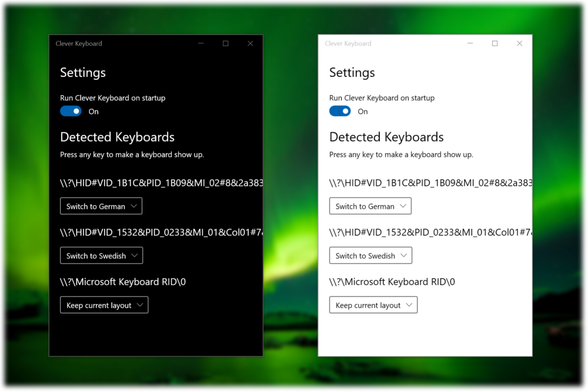

#  Clever Keyboard

This app is for everyone who uses keyboards with different layouts on windows.
As you'll know windows won't remember what layout belongs to which keyboard.

We can change that. This app will choose the correct keyboard every time you press a key.
All you have to do is choose which layout belongs to which keyboard.

The app runs in the background to keep your layout updated. You can always make it show up again by double clicking the notification icon.

## Credits

Credit where credit is due. This is heavily inspired by [Right Keyboard](https://github.com/agabor/RightKeyboard).

The UI is built with the wonderful [ModernWPF UI Library](https://github.com/Kinnara/ModernWpf).

The notification icon is done with help from [Hardcodet NotifyIcon for WPF](https://github.com/hardcodet/wpf-notifyicon).

Settings are serialized and stored in JSON using [Newtonsoft Json.Net](https://github.com/JamesNK/Newtonsoft.Json).

The screenshot background is a photo taken by [v2osk](https://unsplash.com/@v2osk) and made available via [Unsplash](https://unsplash.com/photos/Ovn1hyBge38).

## Getting started

You can either head over to the [releases](https://github.com/flostellbrink/CleverKeyboard/releases) and grab that file or clone the repository and build the solution yourself.
